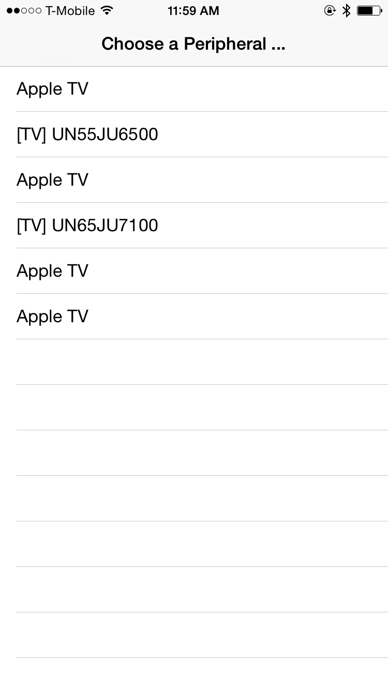

# GFBLEManager
Easy to use for connecting a peripheral with a BLE Module.

#How to use

1. Use GFBLEConnector to scan for peripherals and connect to a peripheral.

1) Initiallize with 'initWithQueue:andDelegate:'. 

2) Call 'startBLEConnectionWithCompletion:' or 'startBLEConnectionWithTimeout:completion:' to start the scan.

3) Implement its delegate method: 'bleDidDiscoverPeripheral:' to fill dataSource.

4) Use 'connectPeripheral:' to connect to the selected peripheral.

2. Use GFBLECommunicator to read/write data from/into the connected peripheral.

1) Initiallize with 'initWithPeripheral:delegate:'.

2) Call 'activePeripheralReadValueForServiceUUIDsandCharacteristicUUID:' or 'activePeripheralReadAllCharacteristicsValue' to read value from the peripheral.

3) Implement its delegate method: 'didRecieveValue:forCharacteristic:error:' to recieve the data.

